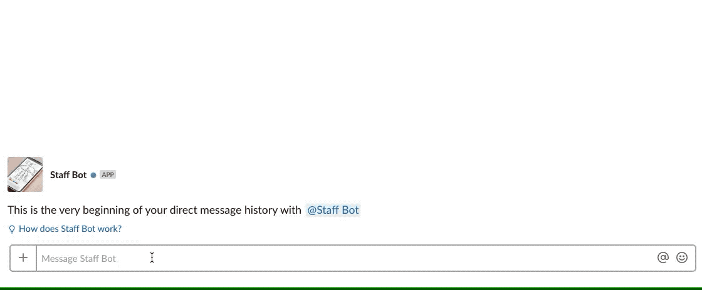

# Staff Slack Bot
Nano Framework for Slack to manage users. Offers a guessing game for users to get to know each other in your company.

# Features

Syncs users to a local Sqlite DB every hour.  
Easily manage your local users when extending the bot:

```
User.get(slack_id='123')
User.phone = 0123456789
User.save()
```

Guessing game uses optional face recognition to filter out avatars that won't offer any value:  





# Requirements
- Python (>= 3.6)
- OpenCV (should be installed by poetry, but if it fails due to ARM based platform, see [here](https://docs.opencv.org/4.0.1/df/d65/tutorial_table_of_content_introduction.html))


# Installation
- [Create App in Slack](https://api.slack.com/apps/new)
- Add Bot for your App, Select `Basic Information`, configure Display Name and Icon
- Take note of `Bot User OAuth Access Token` from `OAuth & Permissions`
- Clone repo
- Add this token to an .env file: `SLACK_BOT_OAUTH_ACCESS_TOKEN='SECRET'`
- Run bot `python staff_bot.py`
- Use something like systemd to run this script permanently
